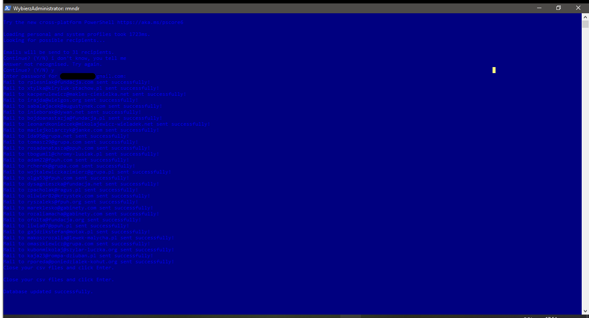

# Project Name
rmndr

## Table of contents
* [General info](#general-info)
* [Screenshots](#screenshots)
* [Technologies](#technologies)
* [Setup](#setup)
* [Features](#features)
* [Status](#status)
* [Inspiration](#inspiration)
* [Contact](#contact)

## General info
This is a simple app which sends e-mails to addresses in database after specified amount of time (given in years). It is designed for small databases that are used by small companies, and its main purpose and intention is to remind customers to repeat an order.

## Screenshots

## Technologies
* Python 3.7.6 (packages: csv, datetime, email, faker, getpass, mimetypes, random, shutil, smtplib)

## Setup
Can be run from command line and it is meant to be run from autostart. Several settings are needed to be set before first use.
If you want to check app running, you have to erase "_example" part from names of *.txt and *.py files.  

## Features
> Done
* Searching in csv database for possible recipients of emails.
* Personalizing messages (html-style) with information from database.
* Starting SMTP server and sending messages.
* Creating backup of database and updating it.
* Adding information about sent e-mails into second database.
* Checking permission for the file.
* Password entering in command line.
* Multiple changeable settings.
* Generating fake database to test changes made in code.

> To-do list:
* Easy personalization for individual companies.
* Possible acceleration of the program by implementing queue data structure.
* Columns title in generated CSV files.
* Setup file.

## Status
Project is: _in progress_

## Inspiration
It is project to be implemented in my job in service industry, which highly relies on loyality of customers.

## Contact
maciej.konieczny.1993@gmail.com feel free to contact me!
